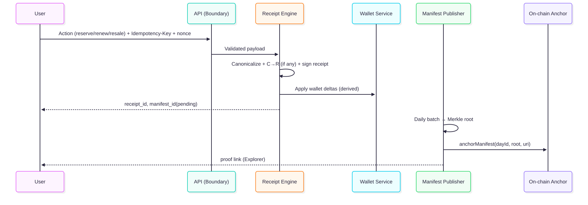

# Architecture Overview (WIP)

**Goal.** Ship fast off-chain, keep receipts/verifiability, and enable on-chain attestations at launch.

---

## MVP (off-chain receipt engine)

- **App/API layer:** auth (email OTP), handles, posts, tags, interactions.  
- **Receipts service:** emits tamper-evident receipts per action.  
- **DB:**
  - `users` (handle, country_code, flags, balances: C, R_future)
  - `posts`, `tags`
  - `receipts` (type, payload_json, sig placeholder)
  - `themes` (config, winners)
- **Jobs/Scheduler:** reservation expiry, theme finale, exports.  
- **Anti-abuse:** rate limits, per-actor caps, whistleblow deductions (reversible).

---

## Data flow (MVP)

1. **Action** (like/tag/save) → **Controller validates** → **Receipts service** builds payload → write **receipt** + update **balances**.  
2. **Theme loop** → ranking reads receipts stream; finale allocates **R_future** and emits `THEME_R_AWARD`.  
3. **Exports:** user profile → “Download my receipts (JSON)”; admin snapshot for migration.

> **Diagram placeholder:** (to add) User → API → Receipts → DB (balances, receipts) → Exports/Attestations.

---

## Security & privacy

- Minimal PII (email, country code).  
- OTP verification, rate-limit per email/IP/device.  
- Audit trail via receipts; admin actions also receipt-logged.

---
## Trust Boundaries

---
## data-flow diagram

---

## Launch options (on-chain attestations)

- **Payout proofs:** publish digest of paid receipts (manifest references).
- **Price-floor attestations:** treasury/floor calculations periodically posted (signed).
- **Optional P2P R:** enable transfers/markets if policy allows; receipts remain source of truth.
- **Selective on-chain events:** emit `StewardAssigned`, `ResaleSettled`, `PotDistributed` for high-value actions.

---

## Compliance notes

- **R treated as income**; KYC tiers & quotas at activation.  
- **C stays on-platform**; `R_future → R` 1:1 at launch (subject to KYC/ToS).  
- Regional onboarding & tax reporting handled via programmatic exports.

---

## Migration (MVP → Launch)

- Snapshot DB + receipt store → validate balances vs receipts → import →  
  display **“Imported from MVP (snapshot X)”** banner to users.  
- Preserve manifest links so historical receipts remain verifiable post-migration.

---

## Scalability & integrity

- Idempotency keys on writes; per-actor nonces; background workers for heavy tasks.  
- Per-actor caps (σ) and recency decay (λ) applied in ranking.  
- Content moderation can **void** fraudulent receipts via **CRL**; corrective receipts applied.  
- SLOs: receipt write p95 ≤ 200ms; drop-open jitter ≤ ±1s; daily manifest by 00:10 UTC.

---

## Interfaces (public)

- `GET /users/:id/receipts.export` → JSON bundle (receipts + manifest refs)  
- `GET /themes/:id/leaderboard` → leaderboard + ruleset_id  
- `POST /whistleblow` → creates deduction receipt (reversible)  
- Static: `/public/keys.json`, `/public/pricing.json`, `/public/limits.json`, daily manifests

---

## TODO

- [ ] Add receipt signing & key rotation policy (`/public/keys.json`; rotation cadence; key IDs).  
- [ ] Publish payout/attestation cadence (treasury schedule; `pricing.json`).  
- [ ] Add schemas: `/specs/receipt.schema.json`, `/specs/manifest.schema.json`.  
- [ ] Define CRL format: `/public/crl.json` (revoked_receipt_ids, reasons, corrective_refs).  
- [ ] Add Receipts Explorer spec (filters, proofs, CSV/JSON export).
